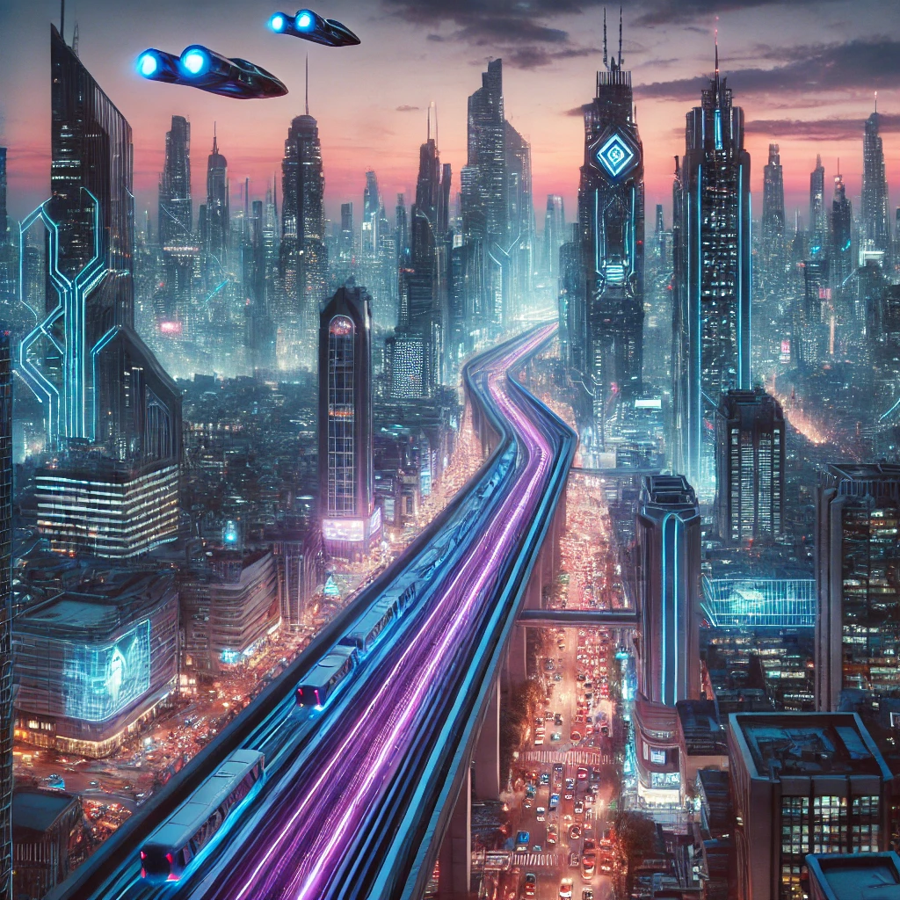

# 🌆 未來城市 Future City Website

> 一個展示未來科技與城市願景的網站，體驗未來城市的美好生活。
> A website that showcases future technology and urban vision to experience the wonderful life of the future city.

[]()
[]()
[]()



## 📖 專案簡介 | Project Overview

這是一個以「未來城市」為主題設計的多頁面網站，透過現代化設計語言，結合動畫效果，呈現科技感十足的介面。使用者可以瀏覽城市介紹、產品內容、最新消息，還可以透過登入頁面進入會員專區。

A multi-page website themed around "Future City," showcasing futuristic design and animations. Users can explore city features, product highlights, latest news, and log in for exclusive access.

---

## 🛠️ 技術棧 | Tech Stack

- HTML5
- CSS3 
    (RWD, 
    動畫效果 Animation effects, 
    日夜模式 Day and night mode，)
- JavaScript 
    (動態互動 Dynamic interaction, 
    加載畫面 Loading screen)
- Rainy.js
- Google Fonts
- Font awesome

---

## 🚀 安裝與使用 | Installation & Usage

### 1. 下載專案 | Download Project

```bash
git clone https://github.com/kusogame68/future-city.git
cd future-city

### 2. 開啟專案 | Open Project
直接打開 index.html 即可在瀏覽器中查看效果。

Simply open index.html in your browser.

🗺️ 網站流程圖 | Site Flowchart

🧩 功能介紹 | Features
💡 首頁動畫：首次進入會顯示 loading 畫面，增強體驗。
Home page animation: The loading screen will be displayed when entering for the first time to enhance the experience.

🏙️ 主題設計：未來感城市設計與配色。
Theme design: futuristic urban design and color matching.

📱 RWD 響應式設計：適配手機、平板與桌面端。
RWD responsive design: suitable for mobile phones, tablets and desktops.

📰 最新消息區塊：展示城市的最新消息。
Latest News Block: Displays the latest news from the city.

📩 聯絡我們表單：方便用戶查詢。
Contact Us Form: Convenient for users to inquire.

🔒 登入頁面：提供會員登入入口。
Login page: Provides member login entrance.

### ❓ 常見問題 / 故障排除 | FAQ / Troubleshooting
Loading 畫面消失太快？
我們使用了 Math.max 方法，確保至少顯示 1 秒。
調整時間可以修改 RWD.js / loading.js 的定時器。
Loading screen disappears too quickly?
We used the Math.max method to ensure it is displayed for at least 1 second.
Adjusting the time can modify the timer in RWD.js / loading.js.


外部資源無法載入？
請確保您的網路正常，或將 Google Fonts 等資源改為本地版本。
External resources cannot be loaded?
Please make sure your network is normal, or change resources such as Google Fonts to local versions.

### 🔗 相關資源 | Related Links
Google Fonts
Font awesome
MDN Web Docs

### ✨ 預覽 | Live Demo
👉 https://kusogame68.github.io/FutureCity-RWD/

### 🙌 特別感謝 | Special Thanks
感謝所有給予建議與測試的朋友，讓這個項目更加完整！
Thanks to all friends who contributed ideas and testing to make this project better!

